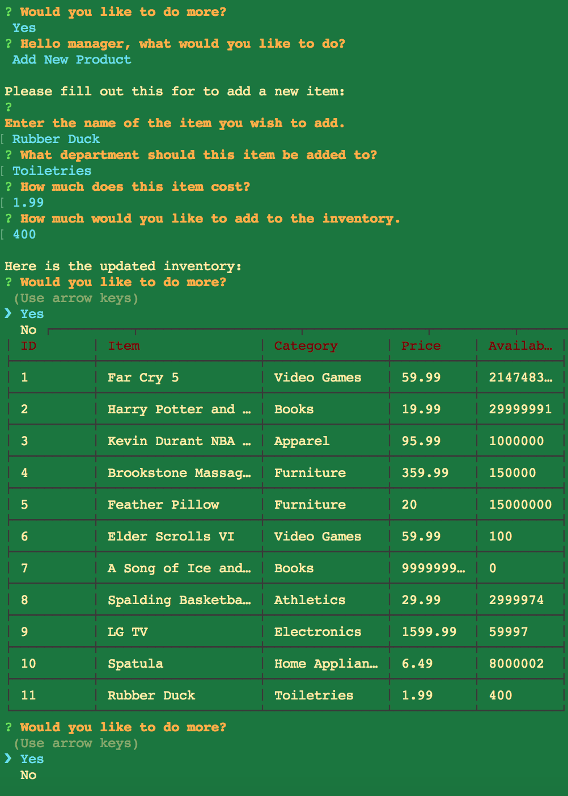

# Bamazon App

One Paragraph of project description goes here



## Getting Started

These instructions will get you a copy of the project up and running on your local machine for development and testing purposes.

This is a CLI node application.
  *ran solely through terminal*

### Installing

to install dependencies
```
npm i
```

## Running the tests


Create local database from schema provided.
*(add table and seeds)*
  - make sure to updat to you local password for mysql in each file being ran.

`bamazon.sql`

```
USE bamazonDB;
```

To run customer view Use
`node bamazon-customer.js`


### Functionality

customer view query example 
```
var updateRev = (getProdSales() + (userQuant * getProdPrice()))
connection.query(
    "UPDATE products SET ? WHERE ?", [{
            product_sales: updateRev
        },
        {
            item_id: answers.itemPurch
        }
    ],
    function(err, res) {
        // console.log(updateRev);
    }
);
```


manager view query example
```
  var query = connection.query(
      "INSERT INTO products SET ?", {
          product_name: answers.prodName,
          department_name: answers.depName,
          price: answers.pr,
          stock_quantity: answers.sq
      },
      function(err, res) {
          console.log("\nHere is the updated inventory:")
          viewProds()
          restart()
      }
  );
```

## Built With

* [mysql](https://www.npmjs.com/package/mysql) - The MySQL pack used


## Authors

* **Sasha Patsel** - *Initial work* - [Bamazon](hhtps://githib.com/sashapatsel)


## Acknowledgments

* Hat tip to anyone who's code was used
